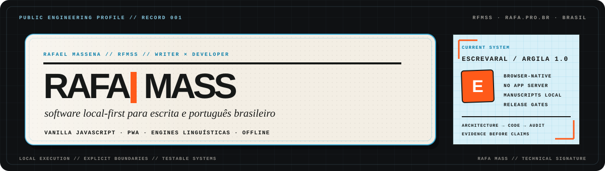

### Escritor que programa. Desenvolvedor que escuta as palavras.

Construo ferramentas de linguagem **gratuitas, privadas e feitas para durar**.

 

## O que estou construindo

<table>
<tr>
<td width="62%" valign="top">

### ✦ [Escrevaral](https://escrevaral.com)

Uma oficina literária no navegador para escritores brasileiros. Editor completo, leitura de ritmo e voz narrativa, organização de projetos e prova de autoria — tudo sem transformar a escrita em matéria-prima para uma nuvem.

`gratuito` · `offline-first` · `sem IA` · `sem cadastro` · `seus textos são seus`

</td>
<td width="38%" valign="top">

### Princípios de produto

↳ **Privacidade é o padrão** 
↳ **A ferramenta não é a autora** 
↳ **Funciona antes de encantar** 
↳ **Acesso não deveria ser luxo**

</td>
</tr>
</table>

## Projetos & experimentos

| Projeto | Uma linha sobre ele | Abrir |
| :--- | :--- | :---: |
| **Bijuled** | Brincadeira visual feita de luz, cor e código. | [visitar ↗](https://rfmss.github.io/bijuled) |
| **Fernanda Towers** | Uma pequena experiência interativa para a web. | [visitar ↗](https://rfmss.github.io/FernandaTowers) |
| **Dirlizanu** | Narrativa digital, interface e experimentação. | [visitar ↗](https://rfmss.github.io/dirlizanu) |
| **Biscoito da sorte** | Um conselho improvável a cada clique. | [abrir um ↗](https://rfmss.github.io/biscoito) |
| **Nota** | Ideias rápidas em uma interface mínima. | [experimentar ↗](https://rfmss.github.io/nota) |

## Ferramentas que escolho

  
  
  
  
  
  

Minha stack favorita é a que desaparece entre a pessoa e aquilo que ela quer criar: web aberta, JavaScript direto, interfaces acessíveis e software local-first.

---

**Código é linguagem. Linguagem também é arquitetura.**

Brasil · [escrevaral.com](https://escrevaral.com) · [rafamass@proton.me](mailto:rafamass@proton.me)

Se algum projeto daqui ajudou você, uma estrela conta essa história para mais alguém.

